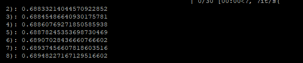
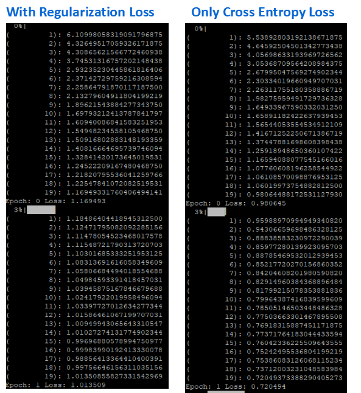
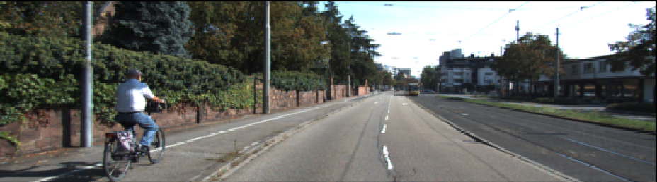
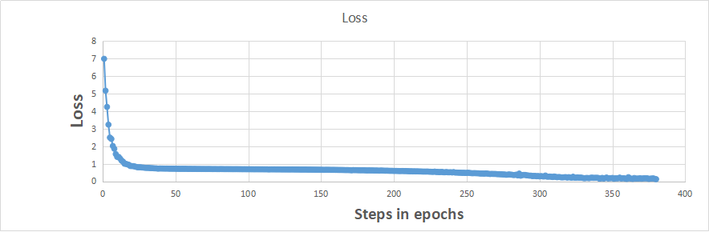

**Semantic Segmentation Project**


The goals / steps of this project are the following:

* Build the FCN from VGG for the object detection tasks
* Tune the graph so that the neural network converge fast

## [Rubrics Points](https://review.udacity.com/#!/rubrics/989/view) 

### 1. Statement of the problem

* Input
Training set of road maps with background, road, and side road marked.

* Output
Predictions of classification of test images.

## 1. Build the Neural Network
The code implement load_vgg, layers, optimize, and train_nn in the main.py. The lost of the network is printed.

### layer implementation
Truncated normal initializers are used to init the kernel weights, and L2 regularizers are used to regularize the kernels. 

Note:
According to the project tips, The outputs of pooling layers 3 and 4 should be scaled before they are fed into the 1x1 convolutions. . I add them and found it really deteriate the results, making the loss getting higher instead of lower. (line 73~75, main.cpp) So it was not involved in my layer definition.
```
   
    vgg_layer3_out = tf.multiply(vgg_layer3_out, 0.0001)
    vgg_layer4_out = tf.multiply(vgg_layer4_out, 0.01)
```



### Optimize implementation
Firstly cross entropy loss is calculated and the learning rate is obtained through tf.train.AdamOptimizer.

Then total loss is calculated to include regularization loss, but this won't improve the convergement.
```
    cross_entropy_loss = tf.reduce_mean(tf.nn.softmax_cross_entropy_with_logits( labels = labels,logits=logits))
    total_loss = cross_entropy_loss+ sum(tf.get_collection(tf.GraphKeys.REGULARIZATION_LOSSES))
```



### Augment images
I tried several methods to generate augmented images (line 102~129). With augmented images, the system converges much faster, but runs much slower...
1) flip the images (between left and right)

But I don't like this idea, since the cars drive on the right normally.



2) change the brightness

A random value is set for gamma, and exposure.adjust_gamma is applied.
This should work very fine as a suplement to the training samples.

3) geometric detortion 

Rotation, shear, and translation are applied in one step with random parameters.

## 2. Neural Network Training results
The model decreases loss over time generally.



I have tried epoch numbers from 5-30, and find at least 20 epochs are needed.
I tried batch size 16-32, and find 32 won't improve the results.
The labeling for the test images are mostly correct. Please see the movie.

I have spent tons of hours trying to generate the video. The order of the images shown in the video seems shuffled. Maybe VideoFileClip should be used.

 